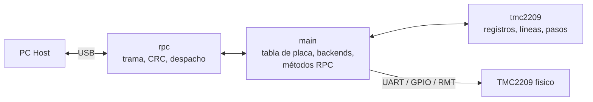
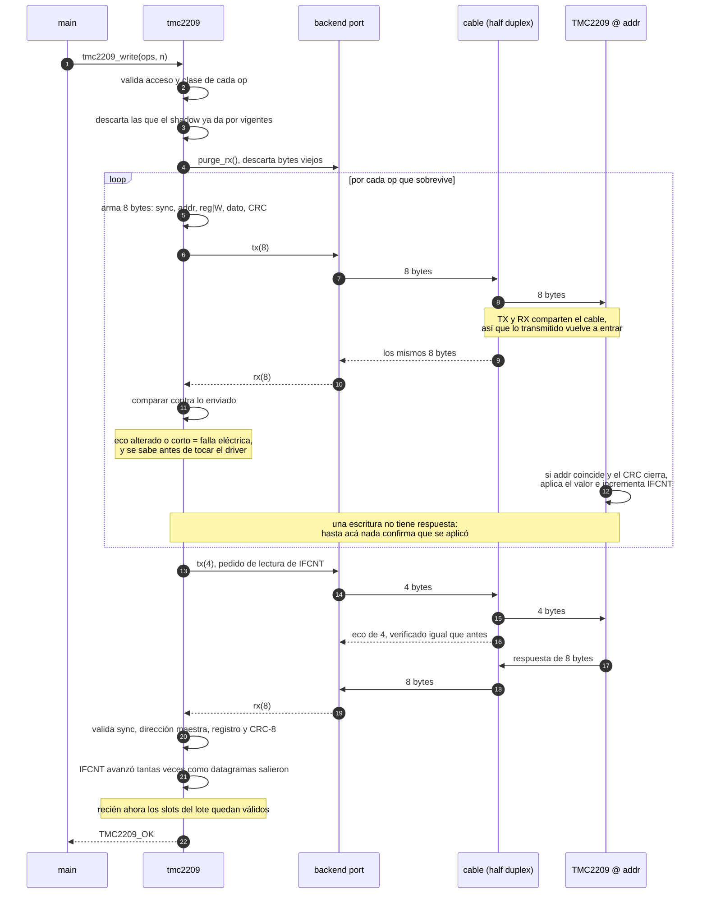
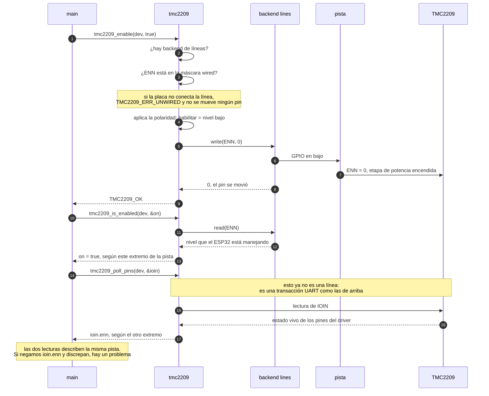
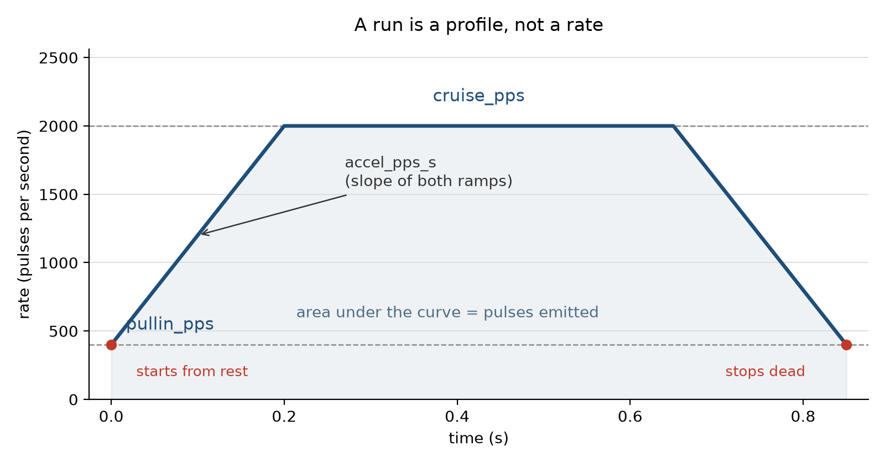
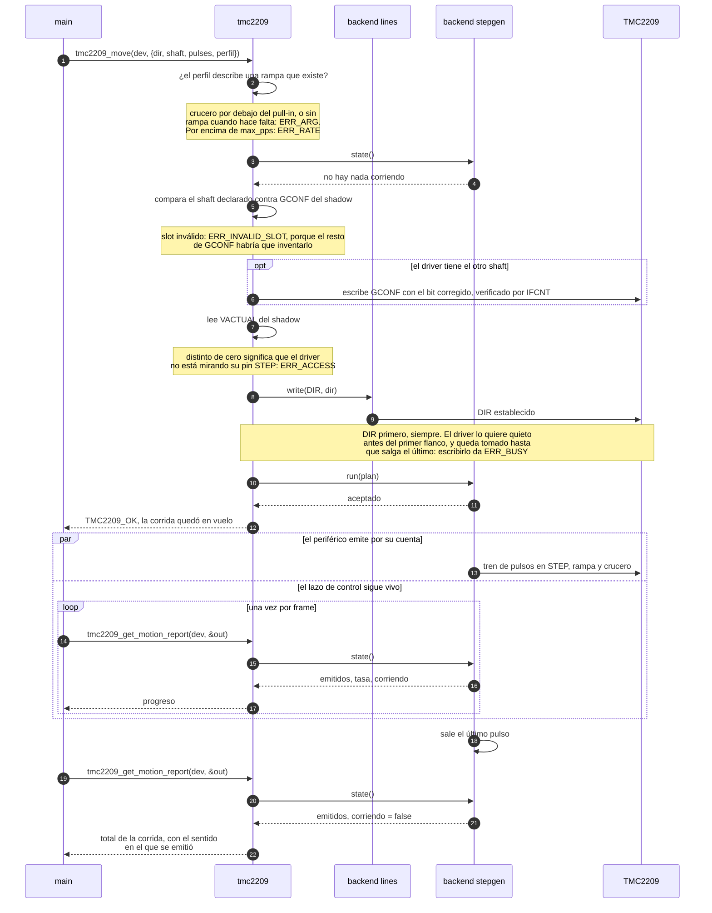
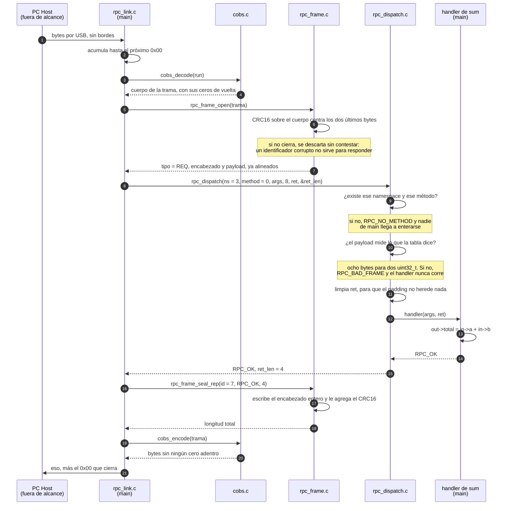

# Firmware

La capa de Firmware del proyecto existe para abstraer el manejo fino de los drivers TMC2209 (señales digitales, datagramas UART de comunicación y la generación de pulsos de avance paso a paso). La idea principal es otorgarle una herramienta a la PC Host que le permita controlar de forma simple e inteligente al sistema de transporte del material fílmico.

## Arquitectura

El módulo presenta tres componentes:

- Comunicación con el Driver (`tmc2209`).
- Comunicación con la PC (`rpc`).
- Código principal de orquestación e interfaces (`main`).

## Comunicación con el Driver: Librería `tmc2209`

La librería TMC2209 tiene tres vías de control para manejar al driver, y cada una resuelve un problema distinto:

| Vía | Qué resuelve | Naturaleza |
| --- | --- | --- |
| UART | Configuración y salud del driver | Transaccional, bytes |
| Líneas de control | Habilitado o no, en qué sentido, qué falla reporta | Niveles instantáneos digitales |
| Pulsos en STEP | Movimiento y velocidad | Temporal, no-bloqueante |

La librería cubre las tres, y las mantiene lo más separadas posible: la única cosa que las une es la estructura del dispositivo. Además, no solo están separadas entre sí si no que funcionan aisladas del sistema en el que operan, ya que cada vía declara un *backend*, es decir un contrato de punteros a función que alguien de afuera debe cumplir:

- `tmc2209_uart_t`: mover bytes, corresponde a UART.
- `tmc2209_lines_t`: leer y escribir un nivel en un pin, corresponde a Líneas de Control.
- `tmc2209_stepgen_t`: emitir un tren de pulsos, corresponde a Pulsos en STEP.

Entonces, quien los implementa contra periféricos reales es otro componente, `main`. Debido a esta abstracción del backend, podemos correr los tests unitarios en una PC host o incluso portear el Firmware a otro dispositivo (por ejemplo, una Raspberry Pi) simplemente adaptando las necesidades del backend.

Una consecuencia de diseño que atraviesa todo lo que sigue: la librería informa, nunca decide.

### Bus UART

El driver expone 24 registros mediante el envío y recepción de datagramas UART, con un único cable half duplex como canal.

Luego de un análisis de los mismos, se encontró que cada registro entra en una clasificación, según quién suele cambiar su valor y qué se suele hacer con él:

| Clasificación | Registros | Qué implica |
| --- | --- | --- |
| **A. Solo escritura del lado del driver, útiles para saber del lado de la librería** | `SLAVECONF`, `IHOLD_IRUN`, `TPOWERDOWN`, `TPWMTHRS`, `TCOOLTHRS`, `VACTUAL`, `SGTHRS`, `COOLCONF` | El driver no contesta una lectura hacia estos registros. El valor lo puso el firmware, así que el firmware es el único que lo sabe. Recordar la copia como variable es la única forma de que el dato exista en la librería. |
| **B. Escritura y lectura del lado del driver, pero el firmware los modifica** | `GCONF`, `CHOPCONF` | A estos registros podríamos leerlos preguntándole al driver, pero una copia local serviría para ahorrar el datagrama de consulta y de respuesta, y como el firmware mismo es el que los modifica, no nos tenemos que preocupar demasiado porque el valor local se haya invalidado con el tiempo. |
| **C. De fábrica, difícilmente modificados** | `FACTORY_CONF`, `OTP_READ`, `PWMCONF` | Nadie los escribe. Los dos primeros traen el trim y los fusibles de esa pieza en particular; `PWMCONF` el driver lo deja escribir, pero este diseño no lo toca porque con autoscale el ajuste fino aparece en `PWM_SCALE` y `PWM_AUTO`. Si nadie escribe, el valor no cambia nunca: alcanza con leerlos una vez. |
| **D. Modificación fuera del firmware** | `GSTAT`, `IFCNT`, `IOIN`, `TSTEP`, `SG_RESULT`, `MSCNT`, `DRV_STATUS`, `MSCURACT`, `PWM_SCALE`, `PWM_AUTO` | Los escribe el driver solamente: `GSTAT` late fallas por hardware, `IFCNT` se incrementa solo, `IOIN` refleja pines, `TSTEP` es una medición, `MSCNT` avanza con cada paso. Una copia sería falsa apenas se guarde, por lo que el acceso al registro deberá pasar por el driver cada vez. |

> Además, se ignora OTP_PROG ya que esta librería no explora en profundidad esa característica actualmente.

Las dos primeras clasificaciones llegan a la misma implicación, guardar el valor y servir las lecturas desde ahí, así que se agrupan como si fuesen registros propios de la librería. De ahí salen las tres **clases** que maneja:

| Clase | Agrupa | Política |
| --- | --- | --- |
| `OWNED`, propios | A y B | Se escriben, se guarda la copia, se lee de la copia. Son diez, y son los que `tmc2209_bringup()` exige completos. |
| `CONSTANT`, constantes | C | Se leen una vez al principio y la copia vale para toda la sesión. Son los únicos que sobreviven a una invalidación: un brownout del driver no cambia el trim configurado de fábrica. |
| `VOLATILE`, volátiles | D | Nunca se guardan. Pedirlos cuesta siempre una transacción, y ese costo es el precio de que la respuesta sea cierta. |

Esa copia local es el *shadow*: un valor por registro (llamado slot) más un bit de validez. El bit importa tanto como el valor, porque dice si la copia todavía describe al driver. Un `GSTAT.reset` significa que el driver se reinició y perdió su configuración, y ahí todos los slots propios se invalidan de golpe.

Sobre el shadow y las clases se apoya la API pública, que se ordena en familias según qué devuelve cada llamada:

| Familia | Función | Qué hace |
| --- | --- | --- |
| Construcción | `tmc2209_init(dev, addr)` | Arma el dispositivo con su dirección. Todos los slots arrancan inválidos, y no existe backend de BUS UART aún para mandar ni recibir datagramas. |
| | `tmc2209_attach_uart(dev, uart)` | Acopla el canal UART con el que se podrá comunicar la librería. Un mismo canal lo pueden compartir hasta cuatro dispositivos, ya que hay dos bits de direccionamiento. |
| | `tmc2209_bringup(dev, config[], n, *at_bringup)` | Inicializa un driver a nivel físico: lee el contador de escritura para usar como base, se fija y devuelve las banderas de estado del driver antes de ser reseteadas, lee registros constantes y configura los registros propios. |
| Valores | `tmc2209_read(dev, reg, *out)` | Lee un registro shadow y no toca el bus nunca. Sirve propios y constantes; rechaza volátiles, porque de esos no hay copia que valga. |
| | `tmc2209_write(dev, ops[], n, *failed_at)` | El lote es la unidad de trabajo: `n` datagramas y una sola verificación al final, así diez registros cuestan once transacciones y no veinte. No se rechaza durante una corrida, aunque tres registros la corrompen sin avisar: `GCONF.shaft` da vuelta el motor a velocidad, `CHOPCONF.mres` cambia cuánto vale un pulso a mitad de camino, y un `VACTUAL` distinto de cero saca al driver de su pin STEP mientras el conteo sigue subiendo. |
| Condiciones | `tmc2209_poll_health(dev, *conditions)` | Transacción real. Cruza `GSTAT` con `DRV_STATUS` y devuelve un conjunto de condiciones, no contenido de registro. |
| | `tmc2209_poll_load(dev, *out)` | La estimación de carga de StallGuard, junto con si se la puede creer. |
| | `tmc2209_poll_pins(dev, *out)` | `IOIN` decodificado: qué ve el driver en sus propios pines. |
| | `tmc2209_poll_version(dev, *version)` | La versión del driver. |
| | `tmc2209_poll_raw(dev, reg, *out)` | Cualquier registro legible, sin interpretar y sin tocar el shadow.|
| Veredictos | `tmc2209_verify_config(dev, *mismatched)` | Contrasta el shadow contra el driver. Solo `GCONF` y `CHOPCONF` se pueden verificar, que son los propios de lectura-escritura. |
| Runtime | `tmc2209_set_velocity(dev, v)` | Escribe `VACTUAL`, inmediato y verificado. |
| | `tmc2209_set_current(dev, *c)` | Escribe `IHOLD_IRUN`. Es runtime porque es deseable varias las corrientes ya que se relacionan directamente con el torque que el motor es capaz de hacer.|
| Passthrough | `tmc2209_uart_send(uart, tx[], tx_len, rx[], rx_len, *rx_got)` | Permite mandar y recibir bytes crudos, sin codificar ni decodificar. Saltea la construcción de framing, utilizado para poder enviar datagramas directamente en caso de que se requiera hacer un bypass de la librería sin utilizar el backend.|

Por debajo, todo eso son datagramas armados en [tmc2209_frame.c](../src/components/tmc2209/tmc2209_frame.c), que es código stateless y sin I/O, puramente sobre arrays de bytes.

De esta forma, se puede apreciar la siguiente operación de escritura y lectura:

Si algo falla, todos los slots del lote quedan inválidos, incluidos los de las operaciones de escritura que ya habían salido: nada de un lote está confirmado hasta el `IFCNT` final. La recuperación es reenviar el lote, que es seguro porque escribir dos veces el mismo valor deja al driver igual.

Características:

- **`IFCNT` como acuse de recibo.** Una escritura no tiene respuesta, así que la única evidencia de que un datagrama llegó es que el contador de escrituras del driver haya avanzado. Es un registro volátil, pero el valor que la librería guarda no es caché y nunca se lee de ahí: es la línea base contra la cual comparar la próxima lectura real. El passthrough también lo incrementa, así que un shadow inválido implica una línea base sospechosa y se debe volver a tomar el valor inicial del contador.

- **El eco como primera validación.** El half duplex obliga a leer de vuelta lo que uno mismo transmitió, y eso se puede tirar o se puede usar. Se usa: un eco alterado o corto es evidencia de un problema eléctrico que ninguna otra lectura da, y aparece antes de que el driver haya tenido oportunidad de contestar.

- **El bus es compartido porque el datagrama lleva dirección.** El segundo byte de un datagrama es la dirección del driver al que va dirijida, que a su vez se fija por los svalores de los pines MS1/MS2 del driver, así que hasta cuatro drivers pueden usar el mismo canal UART y cada uno ignora lo que no es para él. Por eso el bus es una estructura aparte del dispositivo.

- **El backend puede ser cualquier cosa.** El contrato son cuatro punteros a función sobre bytes. Detrás puede haber un periférico UART del ESP32, un puerto serie de la PC, un socket UDP contra un simulador, un descriptor de archivo o un array en memoria en un test. La única cosa que sí necesita saber es si ese canal hace eco, porque un backend full duplex no devuelve lo transmitido, y eso lo declara el propio port.

- **`VACTUAL` se debe tratar con cuidado.** Un `VACTUAL` distinto dejasin efecto al pin STEP, en silencio y sin levantar ninguna falla. Los pulsos siguen saliendo y siguen contándose, pero no mueven nada.

- **Reintentos acotados.** Un CRC malo o un timeout se reintentan tantas veces como declare el bus, con la salvedad de que un reintento puede inflar al contador de escrituras `IFCNT` por demás. Por eso la verificación compara contra una cota y no contra una igualdad exacta.

- **El passthrough.** `tmc2209_uart_send()` es la vía para diagnosticar al driver: nada de la respuesta se juzga, ni siquiera un CRC malo, porque quien llama por acá sospecha del driver. Una respuesta corta se informa con cuántos bytes llegaron, en vez de descartarse.

### Líneas de Control

UART configura al driver, pero no es suficiente. Existen cuatro pines que modifican el estado y la acción del driver, pero que dependen de un módulo GPIO y niveles lógicos en vez de una transmisión serie por UART: `ENN`, `DIR`, `STEP` y `DIAG`.

Igual que en el `port`, este componente también es agnóstico. El backend escribe y lee niveles, nada más. Sostener un nivel un tiempo mínimo, y emitir trenes a una tasa, es temporización, y eso es problema del generador de pasos.

El backend trae además una máscara `wired`, un bit por línea. Una línea que la placa no conecta no se simula ni se ignora en silencio: toda llamada que la nombre responde `TMC2209_ERR_UNWIRED`. Esto es lo que permite que el mismo binario sirva a una placa con un driver que maneja el pin enable mediante un sistema ajeno al controlador, por ejemplo.

Sobre esa base, cada línea tiene su particularidad:

- **DIAG** es entrada. Escribirla se rechaza con `TMC2209_ERR_ACCESS`.
- **ENN** se decidió invertirlo en la API pública, para que la función `tmc2209_enable(dev, true)` que es fácil de leer y de escribir signifique lo que el driver necesita (que haya un cero lógico en su entrada `ENN`, enable-not).
- **DIR** depende del mundo externo. Qué nivel es "adelante" lo decide `GCONF.shaft` combinado con cómo esté montado el motor, así que la línea sola no alcanza y el sentido real se sabrá al mover realmente el motor. Además queda tomado mientras haya una corrida en vuelo, por lo que se explica en generación de pasos.
- **STEP** deja de pertenecer a esta API en cuanto se le adjunta un generador de pasos. Un periférico atado al pin y un `gpio_set_level()` sobre el mismo pin es un conflicto, así que a partir de ahí `tmc2209_line_write()` sobre STEP se rechaza.

Vale la pena notar que `tmc2209_line_read()` sobre una salida devuelve el nivel que se está manejando desde el ESP32, mientras que `IOIN` (por UART) devuelve lo que ve el driver en ese mismo pin. Son los dos extremos de la misma pista, y que discrepen es evidencia de algun fallo.

El siguiente diagrama sigue una habilitación del driver y su comprobación desde los dos extremos:

### Generación de pasos

`STEP` es la cuarta línea del driver y no se parece a las otras tres. `ENN` y `DIR` se sostienen en un nivel, `DIAG` es también un nivel que se lee, pero a `STEP` lo que le importa no es en qué nivel está sino cuántas veces cambió y cuán separados en el tiempo estuvieron esos cambios (pulsos), ya que cada flanco avanza un microstep. Un nivel es un estado, y un tren de pulsos es una función del tiempo, así que las dos cosas deberían tener backends distintos.

Las consecuencias de esa diferencia son tres, lo cual influye en el diseño resultante:

1. **Hace falta un periférico.** Cuatro mil microsteps a diez mil pulsos por segundo son cuatrocientos milisegundos de flancos que tienen que salir parejos, y sacarlos desde código sería ocupar el procesador entero para hacer algo que un RMT, un MCPWM o un timer hacen solos. Por eso el generador de pasos es su propio backend, con su propio contrato, y no una función más del backend de líneas: este backend entocnes deberá interactuar con el tiempo de manera cotidiana. Es el único de los tres que lo hace (sin contar los timeouts de UART).

2. **La API tiene que ser asíncrona**. Una llamada que volviera cuando el movimiento terminó dejaría al lazo de control congelado esos cuatrocientos milisegundos, justo mientras el motor se mueve, que es cuando hay algo para vigilar. Entonces `tmc2209_move()` vuelve apenas los pulsos están en camino, y queda el movimiento ocurriendo de fondo con un estado. Consultarlo es a través de `tmc2209_motion()`.

3. **El movimiento no puede empezar ni terminar de golpe**. Un motor paso a paso al que se le pide más aceleración de la que puede dar se queda atrás, patina, y se mueve una distancia desconocida. Por eso una corrida no se describe con una velocidad sino con un perfil:

`pullin_pps` es la tasa más rápida a la que este motor con esta carga puede arrancar desde quieto y frenar en seco sin perder sincronismo, así que es una propiedad del mecanismo y viene de la tabla de la placa. El último pulso importa tanto como el primero: frenar de golpe desde la velocidad crucero pierde sincronismo igual que arrancar en crucero. Una corrida demasiado corta para terminar de acelerar nunca llega a `cruise_pps` y el perfil se vuelve un triángulo, que igual tiene que aterrizar en la cuenta exacta de pulsos pedida.

Lo que el backend debe garantizar es entonces:

| Garantía | Por qué |
| --- | --- |
| Cuenta exacta | Una corrida acotada emite esa cantidad de pulsos y ni uno más. Solo puede emitir menos si se la frena, y entonces debe informar cuántos salieron. |
| Contador veraz | La cuenta sobrevive al final de la corrida y a una frenada inmediata. Es el único registro físico de cuánto se movió el film, así que un contador que era correcto hasta la última interrupción es peor que inútil. |
| Corridas cortas | Dos pulsos con una rampa larga son un triángulo que nunca llega a crucero, y aterrizan igual en exactamente dos. |
| Ancho mínimo | Todo pulso dura al menos `min_pulse_ns`, a cualquier tasa. El backend declara ese número y la librería lo contrasta contra los 100 ns que pide la hoja de datos al momento de acoplarlo. |

El backend cuenta flancos y nada más: no se fija ni en el sentido de movimiento ni en la resolución de microstep. Y por otro lado, todo lo que le da sentido a esa cuenta de flancos vive del lado de la librería.

Sobre esa base, la API pública:

| Función | Qué hace |
| --- | --- |
| `tmc2209_attach_stepgen(dev, stepgen)` | Acopla la fuente de pulsos, una por driver. Rechaza un backend al que le falte cualquiera de sus cuatro llamadas, uno que declare `max_pps` cero, o uno que no garantice el ancho mínimo. A partir de acá el pin `STEP` es suyo y `tmc2209_line_write()` sobre `STEP` se rechaza. |
| `tmc2209_is_running(dev, *running)` | Pregunta si el backend está emitiendo pulsos. |
| `tmc2209_move(dev, *m)` | Arranca una corrida según un plan de acción que marca sentido, velocidades, aceleración y cotas. La única llamada asíncrona de toda la librería y vuelve enseguida. |
| `tmc2209_retarget(dev, cruise_pps)` | Cambia la tasa de crucero de una corrida en vuelo, manteniendo la rampa con la aceleración del plan de acción original. |
| `tmc2209_halt(dev, immediate)` | Termina la corrida, cortando en el próximo pulso o desacelerando hasta `pullin_pps`. |
| `tmc2209_get_motion_report(dev, *out)` | Recoge los pulsos de la corrida, la tasa actual, si todavía está andando, y el `dir` y `shaft` con los que arrancó: el conteo es una magnitud y ese par es su signo. Recogerlo una vez terminada la corrida es lo que habilita la siguiente. |

La librería por sí sola no garantiza un encoder para el motor o un lazo cerrado, pero sí ofrece un reporte de movimiento dinámico en cada corrida. El backend guarda uno reporte "singleton", y su contenido será de la corrida en curso o de la última (no habiendo ninguna en curso). Además, desde la librería se promueve su lectura ampliamente, al punto que olvidar leer el reporte al terminar una corrida no permite empezar una segunda.

`tmc2209_move()` es donde se junta todo, porque `DIR` es una línea, `STEP` es una tasa, y las dos tienen que estar de acuerdo antes del primer flanco. Y hay un tercer dato en juego: `GCONF.shaft` invierte el orden de fases como `DIR`, así que solo el par `DIR` más `shaft` decide hacia dónde gira el motor. Son cuatro combinaciones que colapsan en dos sentidos.

Por eso la corrida declara los dos valores y la librería los deja en efecto: pone el nivel en `DIR` y si es necesario, reescribe `shaft` con el valor correcto, todo antes del primer pulso. Cuál de las combinaciones es "adelante" depende de cómo esté montado el motor y del cableado, y esa elección es de `main`: fijar `shaft` en 0 y usar `dir` para elegir el sentido es una convención perfectamente válida, pero es una decisión que no pertenece acá.

Características:

- **El reporte se actualiza en vivo y conviene leerlo entre corridas.** `tmc2209_get_motion_report()` le pregunta al generador de pulsos: durante la corrida, los pulsos que ya salieron; una vez que termina, los pulsos totales. El backend guarda una corrida por vez, así que el próximo `move()` pisa ese total. La librería no lo impide: quien necesita la cuenta es quien la lee.

- **El sentido viaja con la cuenta, no con los pines.** El reporte devuelve el `dir` y el `shaft` con los que arrancó la corrida, porque la cuenta es una magnitud y necesita signo. Nada congela `DIR` ni `GCONF.shaft` mientras la corrida está en vuelo: cambiarlos a mitad de camino da vuelta el motor a velocidad y hace que los pulsos de antes y los de después caigan bajo el mismo número, sin que nada lo detecte. Es responsabilidad de quien lo escriba.

- **La cuenta es de pulsos emitidos, no de pasos exitosos.** Coinciden mientras el motor no pierda sincronismo ni ocurra un `TMC2209_DRIVER_RESET` por ejemplo, que es el aviso de que pueden haber dejado de coincidir.

- **Una tasa por encima de `max_pps` se rechaza, no se recorta.** Un movimiento que anduvo más lento de lo pedido es un problema de cadencia y puede devenir en un error de posición.

- **`halt()` no es una parada de emergencia.** Incluso la forma inmediata termina el pulso en curso, y la rampeada sigue pisando hasta `pullin_pps`. Lo verdaderamente urgente es cortar la etapa de potencia con `tmc2209_enable(dev, false)`, que es sincrónico y no necesita que ningún periférico coopere.

- **Una corrida sin fin es una función, no un descuido.** `pulses = 0` corre hasta que se la frene, y es lo que sirve para una bobina: la tensión depende del radio, el radio cambia mientras se enrolla, y `tmc2209_retarget()` mueve la tasa sin meter una frenada y un arranque en el medio del lazo. Por eso ahí sí se acepta una tasa por debajo del pull-in: el pull-in acota arrancar y frenar, no andar.

- **`VACTUAL` y `STEP` se pelean el motor.** Es el mismo conflicto que aparece en el bus UART, visto desde este lado. Se revisa solo cuando el shadow puede contestar, porque una negativa fabricada a partir de un slot inválido es peor que la ausencia del chequeo.

## Comunicación con la PC: Librería `rpc`

Del otro lado del firmware, habrá una PC que quiere cosas distintas según el momento: diagnosticar un driver que no contesta, verificar que la librería hace lo que dice, saber si el firmware está en condiciones de recibir órdenes, pedir un escaneo. Son pedidos de naturaleza distinta, pero todos necesitan lo mismo: que un mensaje llegue entero, que se sepa a qué función corresponde, y que la respuesta vuelva asociada a su pedido.

Eso es lo que se conoce como un Remote Procedure Call (RPC) y es todo lo que hace este componente. `rpc` no nombra ni un solo método, solamente mueve tramas. Para poder hacer que el pasaje de mensajes sea realmente llamadas a procedimientos, `main` mapea las tramas a funciones al arrancar, y es de lo que habla la sección siguiente.

Lo que entonces engloba a la librería en sí son cuatro componentes:

| Componente | Qué resuelve |
| --- | --- |
| `cobs` | Una trama debe ser identificada como tal. La codificación `cobs` garantiza que no quede ningún cero adentro de la trama, entonces podemos utilizar ese cero para darle fin a la misma, nunca significando otra cosa. De esta forma, un receptor perdido se resincroniza a lo sumo una trama después. No se perdería el canal de comunicación indefinidamente, como sí pasaría si se usara un campo de longitud, por ejemplo.|
| `crc16` | Una trama bien delimitada todavía puede venir corrupta. El CRC hace que se rechace en vez de decodificarse. |
| `rpc_frame` | Pone un encabezado y un CRC alrededor de un payload, y se los saca. Nunca mira lo que hay adentro: para él es un tramo de bytes, y para quien pidió la llamada es un struct. |
| `rpc_dispatch` | Convierte un namespace y un número de método en una llamada, contra tablas que alguien de afuera registra. |
| `rpc_proto` | Lo mínimo que las dos puntas tienen que acordar para intercambiar una trama: qué tipos de trama hay, cuán grande puede ser, que un estado es un byte, y las tres reglas de layout que hacen que un struct se pueda leer en el lugar. |

De esta forma, además podemos concluir:

**Por el cable viajan structs, y el layout se declara en vez de heredarse.** Un struct es un layout de memoria, y un layout librado al compilador es padding, ancho de enum y tamaño de `bool`: dos compiladores, uno apuntando a xtensa y otro a x86-64, tienen todo el derecho a no coincidir en los tres. La salida no es evitar el struct, es no dejarle ninguna de esas tres decisiones al compilador. Nada lleva `packed`, cada campo cae en un offset múltiplo de su propio ancho por medio de miembros `_pad` declarados, ningún `bool` ni ningún enum viaja como tal sino como `uint8_t`, y cada struct afirma su propio tamaño con un `_Static_assert`. Un layout que se corre deja de compilar en la punta que se corrió, que es la única forma de que alguien se entere de un desacuerdo.

**Nada lleva `packed`, y eso no es una preferencia.** Un struct empaquetado pone `uint32_t` en offsets impares, y en xtensa una lectura de 32 bits desalineada es una excepción y no una lectura lenta. Por eso los tres encabezados miden exactamente ocho bytes: el payload arranca siempre en un offset múltiplo de cuatro, y sus campos quedan alineados sin que nadie tenga que pensarlo. Eso es también lo que permite pasarle a la librería un puntero adentro de la trama de respuesta, y que el valor no exista en ningún otro lado.

**El layout se escribe una sola vez.** Escribirlo de los dos lados son dos implementaciones de un mismo acuerdo, y la segunda se desincroniza. Así que `rpc_api.h` no incluye más que `stdint.h` y `rpc_proto.h`: la PC lo parsea con cffi y obtiene los mismos structs que compiló el firmware, en lugar de reimplementarlos. Ese es también el motivo de que no haya CBOR ni protobuf: existen para negociar estructura entre partes que no pueden compartir código, y estas dos sí pueden.

**No hay serializador, y eso es una consecuencia.** Un escritor campo por campo existe para dos cosas: llevar la cuenta de dónde va el próximo campo, y acordarse de que algo no entró. Las dos nacen de escribir campo por campo. Cuando el payload es un struct, el struct es el layout y un único chequeo de longitud reemplaza a la bandera de error, así que ninguna de las dos sobrevive.

Sobre esa base, tres tipos de trama comparten el enlace RPC y el primer byte dice cuál es: pedido, respuesta y log. La respuesta repite el identificador del pedido que contesta, lo que evita que una respuesta demorada se lea como la de otra pregunta. El log es la única trama que sale sin que nadie la haya pedido: no espera acuse, no obliga a nada, y un cliente al que no le interesa la descarta mirando un solo byte. Que exista como tipo de trama es del transporte; quién la produce y por qué es de `main`.

Con todo eso junto, vale la pena seguir una trama entera. El ejemplo es inventado a propósito: un método `sum` que suma dos enteros, que no existe en ninguno de los cuatro namespaces, justamente para que lo único que se vea sea el camino. El lado de la PC no se modela, porque este documento explora el firmware: alcanza con saber que manda una trama pidiendo 2 más 3 y espera una con el 5.

Los actores son archivos, y están los que aparecen más de una vez en el camino. El primero es de `main` y no del componente, pero es quien lo usa, así que sin él la trama no llega a ninguna parte.

Dos cosas que el diagrama deja ver mejor que la prosa. El estado se escribe una sola vez: el encabezado se sella al final, cuando ya se sabe qué pasó y cuánto mide la respuesta, así que no queda nada por corregir después. Y la validación de argumentos ocurre antes del handler y no después, porque la longitud que cada método espera vive en la tabla al lado de la función: el handler no llega a ver una trama que no mide lo que debía, y por lo tanto tampoco tiene que acordarse de chequearlo.

Los pocos métodos que llevan un lote, una tira de bytes o una lista son la excepción, y solo porque la cuenta que zanja su longitud viaja adentro del payload, donde `rpc_dispatch` no puede verla. Ahí la tabla aporta un mínimo y el handler concilia el resto en un `if`. Son cinco de veintiséis, y es el único lugar donde una longitud se chequea a mano.

## Interfaces RPC. `main` I

La librería `rpc` solo nos ofrece una manera de transferir tramas y asociarlas con llamadas a funciones, pero naturalmente se entiende que la librería necesitará de una capa compartida para normalizar las diferencias con las otras librerías con las que interactúe. En este caso, se sabrá lo siguiente:

| Archivo | Qué aporta |
| --- | --- |
| `rpc_api.h` | El vocabulario compartido entre la PC y el firmware: qué namespaces existen, qué número tiene cada método, qué estados puede devolver un handler y qué versión de protocolo se habla.|
| `rpc_status.c` | La correspondencia entre el error de la librería `tmc2209` y el estado que viaja por el cable. Son dos vocabularios practicamente idénticos. |
| `rpc_methods.h` | Declara las tres tablas de handlers, para que la raíz de composición pueda registrarlas sin nombrar a ninguno. |
| `rpc_passthrough.c` | El handler de `passthrough`. |
| `rpc_raw.c` | Los handlers de `raw`, uno por función pública de `tmc2209.h`. |
| `rpc_sys.c` | Los handlers de `sys`. |
| `rpc_link.c` | Ata todo eso al cable: junta los bytes que llegan por USB, le entrega las tramas al dispatch y devuelve la respuesta. |

Los tres primeros y los dos handlers de driver no incluyen nada de ESP-IDF, y por eso `test/unit` los compila en la PC contra un mock. Los que sí lo incluyen son `rpc_sys.c`, que pregunta por el descriptor de la aplicación y el uptime, y `rpc_link.c`, que habla con el periférico USB. `smart` todavía no tiene archivo.

Esto nos permite generar cuatro namespaces de procedimientos remotos, y la pregunta que los ordena es a quién le está hablando la PC en cada caso:

| Namespace | La PC le habla | Quién arma los bytes que van al driver |
| --- | --- | --- |
| `passthrough` | al **driver** | la PC |
| `raw` | a la **librería** | el firmware, a partir del registro que le nombres |
| `sys` | al **sistema** | nadie, no hay driver en la pregunta |
| `smart` | al **digitalizador** | el firmware, a partir del resultado que le pidas |

### Hablarle al driver: `passthrough`

La primera necesidad es probar el driver, y ahí el ESP32 tiene que desaparecer lo más posible. Si el datagrama que sale del cable lo armó el firmware, entonces cuando algo no anda hay dos sospechosos y no uno.

Por eso este namespace nació pegado a `tmc2209_uart_send()`, que es la función de la librería que existe para esto mismo: bytes crudos adentro, bytes crudos afuera. La PC arma el datagrama completo, con su dirección y su CRC, usando los mismos codecs que usa el firmware, y recibe de vuelta lo que el driver haya contestado sin interpretar. Un CRC malo no es un error acá, es el dato: puede ser exactamente lo que el experimento quería provocar. Una respuesta corta se informa con cuántos bytes llegaron.

Tiene un solo método, `passthrough.send`, y va a seguir teniendo uno solo.

Lo único que el firmware sí hace por su cuenta es invalidar el shadow después de una escritura por acá, porque un datagrama que la librería no armó es uno del que no puede responder.

### Hablarle a la librería: `raw`

La segunda necesidad es probar la librería, y para eso hace falta poder llamarla. `raw` es exactamente eso: una proyección de la API pública de `tmc2209.h` sobre RPC, un método por función, mismos parámetros, misma semántica y mismos errores. Los nombres de error son los de la librería sin el prefijo, porque `raw` no inventa errores y entonces tampoco necesita inventar un vocabulario para nombrarlos.

Esa correspondencia es la regla de borde: si es una llamada `tmc2209_*` va acá, y nada de lo que hay acá decide nada que la librería no haya decidido antes. La numeración de métodos sigue el orden del header.

Una consecuencia que conviene tener presente: el shadow es visible en este nivel, no está escondido detrás. `raw` es crudo respecto del ESP32, y el shadow es parte de lo que el ESP32 es, así que preguntarle a la caché y preguntarle al silicio son dos preguntas distintas y por lo tanto dos métodos distintos.

### Hablarle al sistema: `sys`

El único namespace cuyas preguntas no son sobre un driver. Antes de que un `raw` signifique algo, la PC necesita saber que está hablando con este firmware, en una versión de protocolo que entiende, y sobre una placa donde los nombres de dispositivo significan lo que ella supone. Ninguno de los otros tres puede contestar eso, porque los tres lo dan por sentado.

`sys.version` es el método que se contesta primero y el único que tiene que poder contestarse en un enlace cuya versión todavía no se acordó, así que la forma de su respuesta no puede cambiar nunca. Después vienen las preguntas de estado: qué está haciendo el firmware, si hay un escaneo en curso que hace que un `raw` o `passthrough` sea inválido en este momento, y qué dispositivos declara la placa. Todo eso son hechos sobre el ESP32 y no llamadas `tmc2209_*`, que es justamente lo que los mantiene fuera de `raw`.

### hablarle al digitalizador: `smart`

La cuarta necesidad es que la PC deje de mandar señales una por una. Un lazo de tensión que vive del otro lado de un cable serie paga latencia en cada iteración, y el firmware ya tiene todo lo que ese lazo necesita.

Pero `smart` todavía no se puede diseñar, porque dos de sus respuestas son mediciones y no decisiones:

1. ¿Cómo se mantiene la película lo suficientemente tensa?
2. ¿Cómo converge un movimiento a un cuadro que el algoritmo de visión acepte, lo suficientemente rápido?

Las dos se contestan experimentando, y lo bueno es que el experimento no necesita que `smart` exista: cada estrategia candidata se maneja con corriente y velocidad por dispositivo, que es exactamente lo que `raw` ya expone. Se prueban desde Python sobre el RPC que ya está, y `smart` después implementa la que ganó. Lo que queda configurable son los números, no la estrategia: una API con una bandera para elegir estrategia suele ser una decisión que nunca se tomó.

Con eso en mente, las funciones tentativas se parecerían más a esto que a un espejo de la librería:

- `set_initial_reels_radii(feed_mm, takeup_mm)`
- `enforce_tension(level)`
- `move(mm)`
- `calibrate()`

## Orquestación. `main` II

Alguien tiene que decidir qué existe, construirlo, conectarlo y decidir qué hacer cuando algo sale mal. Eso es el resto de `main`, y son cinco archivos con una responsabilidad cada uno.

| Archivo | Qué decide |
| --- | --- |
| `board.h` / `board.c` | Qué drivers existen, con qué dirección, en qué pines y a qué velocidad. Los números salen de Kconfig, así que una placa de banco cableada distinta es `idf.py menuconfig` y no un parche. |
| `backends.c` | Cómo se cumplen los contratos de la librería contra periféricos reales: UART, GPIO. Nada de política acá, solo "los bytes salieron" y "el pin está en alto". |
| `devices.c` | Construye cada driver de la tabla y le acopla sus backends, una sola vez y al arrancar. |
| `watchdog.c` | Qué pasa cuando la PC deja de hablar. |
| `dev_main.c` | El orden en que todo eso ocurre. |

### La raíz de composición

Que las dos librerías existen ya lo saben los puentes: `rpc_raw.c` incluye `tmc2209.h` y `rpc_dispatch.h`, porque es justamente donde se tocan. Lo que ninguno de ellos decide es si están instalados. `dev_main.c` sí, y es el único archivo al que nadie llama: los demás ofrecen una capacidad, este elige cuáles entran en esta imagen. Registra los tres namespaces, levanta el enlace y recién después construye los dispositivos.

Ese orden es a propósito y es al revés de lo que uno escribiría primero. La construcción es lo más probable que falle en una placa cableada a mano, y una falla que ocurre antes de que exista un lugar donde reportarla es una falla que nadie ve. Por eso el enlace sube primero, y por eso una construcción fallida no es fatal: el enlace queda arriba, `sys.state` responde `FAULT`, y la PC se entera de qué pasó. Una placa que se queda muda cuando su cableado está mal es una placa que se depura con un multímetro en vez de con la herramienta que ya tenés abierta.

La otra decisión de esa raíz es que no hace nada por su cuenta. Una placa de desarrollo que mueve un motor al arrancar es una placa que no podés dejar enchufada, y además todo lo que esta imagen sabe hacer es alcanzable desde la PC de todos modos.

### Construir siempre, no cuando haga falta

`devices.c` construye todos los drivers de la tabla al arrancar, sin condiciones. No hay un modo en el que un dispositivo todavía no exista.

La alternativa, construirlos cuando alguien los pide, hace que el camino de producción y el camino probado sean dos caminos distintos. Así, en cambio, el estado desde el que arranca un escaneo y el estado que ve un script de diagnóstico son el mismo estado, alcanzado por el mismo código.

Lo que varía entre placas entonces no es *si* un dispositivo existe, sino qué tiene. Un driver sin generador de pasos contesta `NO_BACKEND` a un `move`; una línea que la placa no cablea contesta `UNWIRED`. Las dos son respuestas de la librería, por llamada y con motivo, y es lo que evita que haga falta una bandera de compilación para cada variante de placa.

### El enlace como hombre muerto

Una corrida arrancada por RPC sobrevive a la llamada que la arrancó. Si el orquestador se cae, o alguien pisa el cable, lo último que el firmware escuchó sigue vigente y el capstan sigue enrollando. El modelo pedido y respuesta no se entera, porque justamente nadie preguntó nada.

Así que el enlace de control es un hombre muerto: cualquier pedido válido lo alimenta. Eso no cuesta nada, porque una PC que está moviendo ya está consultando el reporte de la corrida, y un latido dedicado solo llevaría información en las raras ocasiones en que no hubiera nada más que decir. Solo lo arma una corrida en vuelo, así que una placa quieta puede quedarse una hora sin que nadie le hable.

Dos detalles de implementación que valen más que su tamaño. El chequeo no es una tarea ni un callback de timer: corre en la misma tarea que ya es dueña de los dispositivos, porque la librería es de un solo dueño por diseño y un segundo contexto llamando a un dispositivo en medio de una transacción sería una carrera con un motor colgando. Y el plazo se acota por arriba, para que un llamador no lo desactive de hecho pidiendo un año.

### Un solo cable

El USB nativo hace todo: flashear, JTAG y esto. Entonces `ESP_LOGI` no puede seguir escribiendo texto plano, porque texto suelto entre tramas es exactamente lo que un desentramador no debe recibir. Levantar el enlace redirige el flujo de log hacia adentro, y desde ese momento un log es una trama como cualquier otra, que termina del lado de la PC junto a los eventos que explica.

El precio es que el puerto tiene un solo dueño: no hay una segunda terminal mirando el mismo cable, y flashear implica cerrar el enlace.

Un detalle del lado de la PC que no es del protocolo pero interesa igual: abrir el puerto serie afirma DTR y RTS por defecto, que es justamente lo que usa `esptool` para meter al chip en el bootloader. Hay que suprimirlos al abrir, o cada conexión reinicia la placa.
